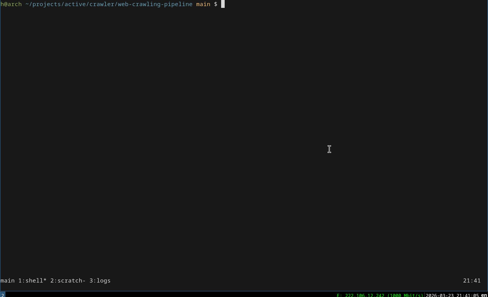

# Web Crawling Pipeline

A CLI-based **production-like web crawling data pipeline** built in Python.

This project goes beyond a simple scraper by implementing a full pipeline:

> **crawl → validate → transform → store → monitor**

---

## CLI Demo



---

# 1. Overview

## Purpose

- Collect data from both static and dynamic web pages
- Ensure data quality through validation
- Normalize data into a structured schema
- Store results in a consistent format
- Provide execution-level monitoring

---

## Core Pipeline

```text
crawl → validate → transform → store → monitor
````

---

# 2. Key Features

## 2.1 Crawling

### Static Crawling

* `requests + BeautifulSoup`
* Direct HTML parsing

### Dynamic Crawling

* `Playwright`
* Handles JavaScript-rendered content

---

## 2.2 Validation

* Required field checks
* Separation of valid vs invalid records
* Basic data quality enforcement

---

## 2.3 Transformation

* Convert raw data into a normalized schema
* Parse price values
* Normalize status fields
* Extract item identifiers

---

## 2.4 Storage

```text
data/
  raw/
  validated/
  transformed/
```

* Stage-based storage
* JSON file outputs

---

## 2.5 Monitoring

* Structured logging
* Execution summary report

```text
reports/latest_run_summary.json
```

---

## 2.6 Robustness

* Retry logic (transient failure handling)
* Rate limiting (request pacing)
* User-agent rotation

---

# 3. Project Structure

```text
src/
  cli/
  crawlers/
    site_a_requests.py
    site_b_playwright.py
  validators/
  transformers/
  storage/
  monitoring/
  utils/
```

---

# 4. Usage

## 4.1 Static Crawling

```bash
python main.py --source site_a --max-pages 2 --limit 10
```

---

## 4.2 Dynamic Crawling

```bash
python main.py --source site_b --max-pages 2 --limit 10
```

---

# 5. Data Flow

## Raw Record

```json
{
  "source": "site_a",
  "listing_url": "...",
  "title": "...",
  "price_text": "£51.77",
  "status_text": "In stock"
}
```

---

## Transformed Record

```json
{
  "source": "site_a",
  "item_id": "a-light-in-the-attic_1000",
  "title": "A Light in the Attic",
  "price": 51.77,
  "currency": "GBP",
  "status": "in_stock",
  "detail_url": "...",
  "collected_at": "2026-03-23T20:30:00"
}
```

---

# 6. Design Principles

## 6.1 Multi-source Architecture

* Separate crawler per source
* Shared pipeline across sources

```text
site_a → requests
site_b → playwright
```

---

## 6.2 Adapter Pattern

Each source is implemented as an independent crawler module:

```text
crawl_site_a()
crawl_site_b()
```

---

## 6.3 Config-driven Design

Centralized configuration for:

* URLs
* timeouts
* retry policy
* rate limiting
* user-agent

→ separates logic from environment settings

---

## 6.4 File-based Pipeline

* No database required
* Easy inspection of each pipeline stage
* Clear data lineage

---

# 7. Tech Stack

* Python
* requests
* BeautifulSoup
* Playwright
* argparse
* pathlib
* logging

---

# 8. What This Project Demonstrates

This project covers:

* Static + dynamic web crawling
* Data validation and normalization
* Structured storage pipeline
* Fault tolerance (retry, rate limiting)
* Execution monitoring

In short:

> A practical, production-like web crawling pipeline

---

# 9. One-line Summary

> A CLI-based multi-source web crawling pipeline with validation, transformation, and monitoring

---

# 10. Future Improvements

* Database integration (PostgreSQL / SQLite)
* Proxy support
* robots.txt handling
* Scheduling (cron)
* Deduplication / upsert logic
